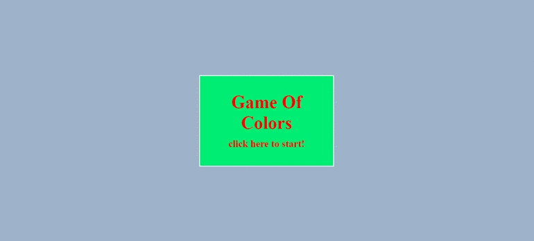

<h1 align="center">🎮 GAME OF COLORS </h1>

<h2 align="center"><a href="">🚀 Clique Aqui Para Jogar 🚀</a></h2>

<h2 align="center">👁‍🗨👁‍🗨</h2>
<h3 align="center">⬇️Demonstração Do Jogo⬇️</h3>
<p>
<h1 align="center"></h1>

## 📋**Sobre**

#Game Of Colors jogo para você se divertir enquanto treina a memória e a concentração. Jogo feito junto ao Bootcamp JavaScript Game Developer.

---

## 🎮**Objetivo Do Jogo**

#Você tem que acertar a sequência de cores apresentada na tela, quanto maior for a senquência de acertos mais pontos você ganha.

---

## 💻**Tecnologias Ultilizadas**

* [Html](https://developer.mozilla.org/pt-BR/docs/Web/Guide/HTML/HTML5)
* [JavaScript](https://developer.mozilla.org/pt-BR/docs/Web/JavaScript)
* [css](https://developer.mozilla.org/pt-BR/docs/Web/CSS)
* [Jquery](https://jquery.com/)

---

## 💾**Clone Do Repositório**

```
#Para fazer clone do repositório ultilizando git use a linha de comando abaixo:

git clone https://github.com/AAndersonSantos/Game-Of-Colors.git

```

---

## 📝**Licença Do Projeto**

[MIT]()
